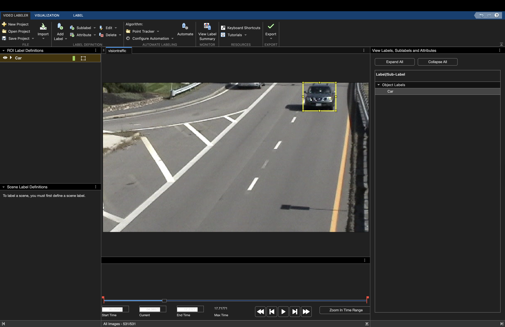

# Solution to MATLAB and Simulink Challenge project 203: Automatically Segment and Label Objects in Video
This is a template repo for MATLAB and Simulink Challenge Project solutions.

Please add the following items:

[Program link](https://github.com/dimwitar/dimitarbogoeski-matlab-project-203-segmentation)

[Project description link]<https://github.com/mathworks/MATLAB-Simulink-Challenge-Project-Hub/tree/main/projects/Automatically%20Segment%20and%20Label%20Objects%20in%20Video>


# Project details
This project uses MATLAB's **Video Labeler App** and **Computer Vision Toolbox** to segment and label vehicles in a traffic video.  
We applied automation using the **Point Tracker (KLT)** algorithm to reduce manual labeling effort and exported the results as a `groundTruth` object.

**Key features:**
- Manual labeling of first visible car frame
- Semi-automated bounding box tracking across frames
- Exported dataset for use in deep learning workflows

# How to run

## Prerequisites:
- MATLAB R2023b or later
- Computer Vision Toolbox
- (Optional) Deep Learning Toolbox

## Instructions:
1. Clone this repository
2. Open MATLAB
3. Set the current folder to the repo root
4. Run the script:
   ```matlab
   run_pipeline

# Demo

  
# References

- [Video Labeler App – MATLAB Documentation](https://www.mathworks.com/help/vision/ref/videolabeler-app.html)  
  Used for manually labeling video frames and applying automation algorithms.

- [Using Ground Truth for Object Detection – MATLAB Video Demo](https://www.mathworks.com/videos/matlab-and-simulink-robotics-arena-using-ground-truth-for-object-detection-part-1-1539772871504.html)  
  Helpful example for working with `groundTruth` objects and exporting labels.

- Yao, Rui, et al. (2020). *Video Object Segmentation and Tracking: A Survey*. ACM Transactions on Intelligent Systems and Technology.  
  [https://dl.acm.org/doi/abs/10.1145/3386252](https://dl.acm.org/doi/abs/10.1145/3386252)  
  Provided background on video object segmentation techniques.

- [MathWorks GitHub Challenge Repository](https://github.com/mathworks/MATLAB-Simulink-Challenge-Project-Hub)  
  Official project template and instructions.
